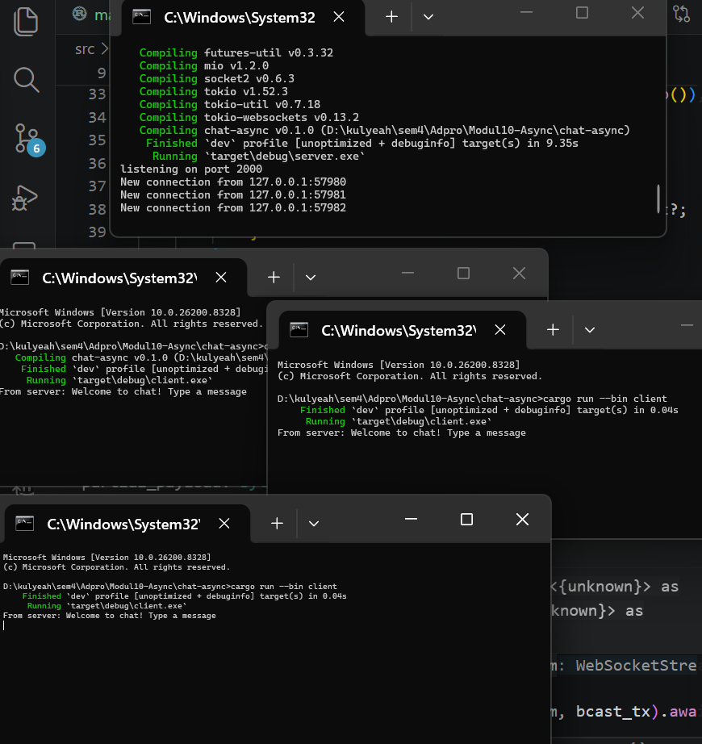
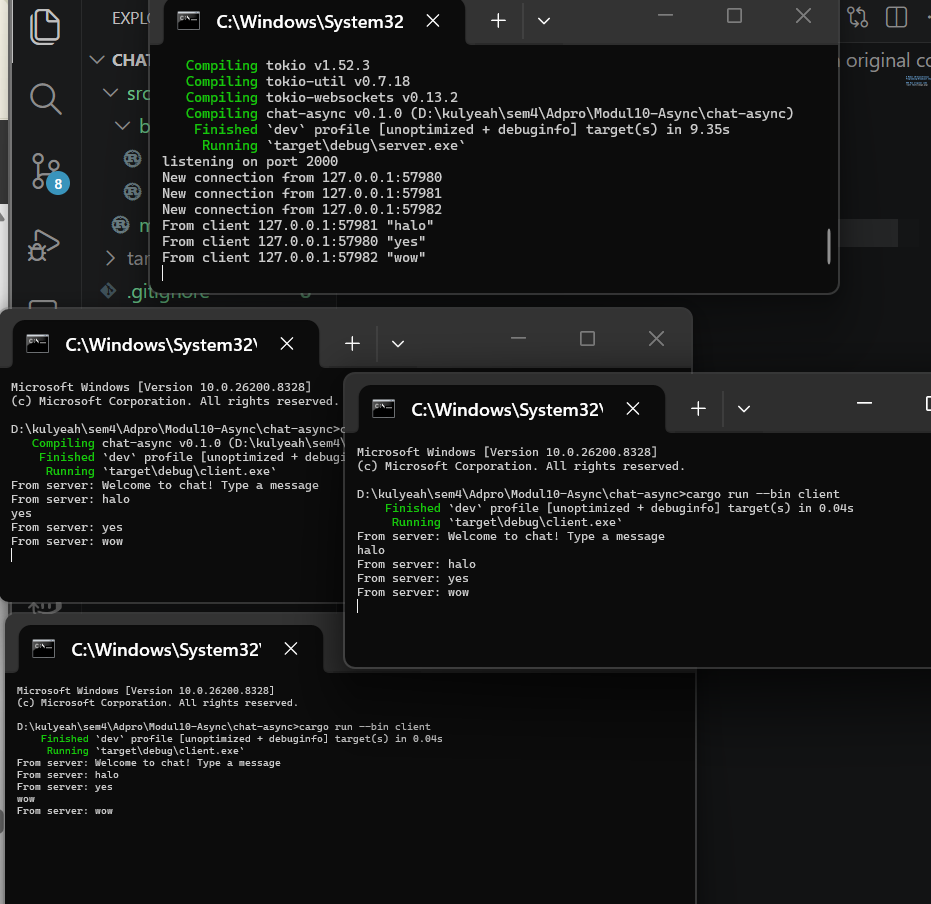
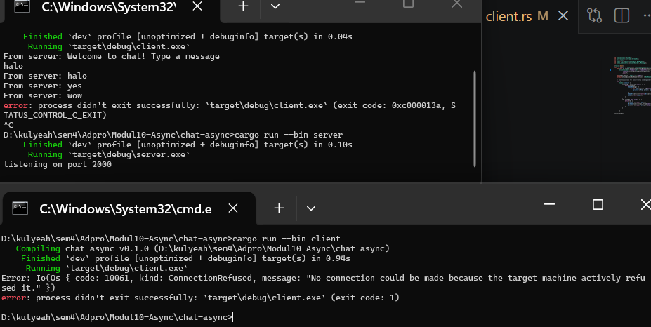
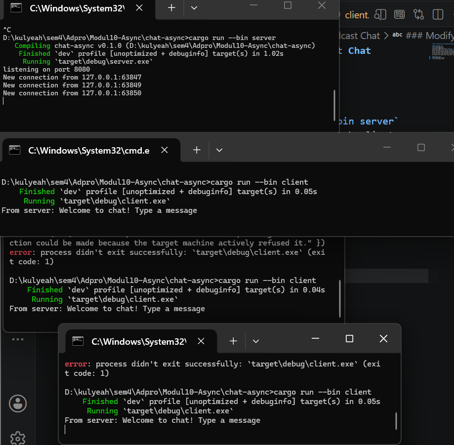
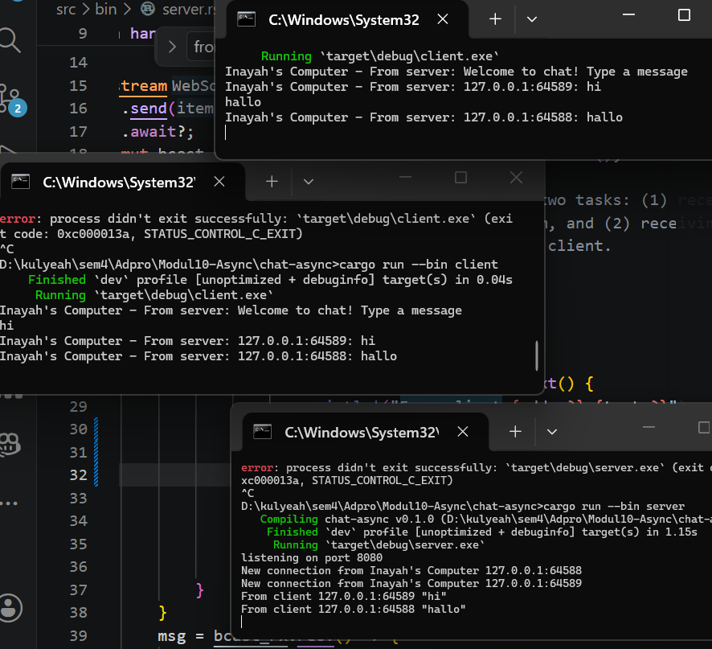

# Modul 10-Asynchronous Programming-Broadcast Chat

### Run original code

Dijalankan menggunakan command `cargo run --bin server` untuk server dan `cargo run --bin client` untuk client. Server akan membuka port 2000 dan listening koneksi yang masuk. Tiap client yang terhubung akan dimasukkan ke sistem broadcast. Saat salah satu client mengirimkan pesan ke server, server menerima pesan tersebut secara asinkron dan broadcast ke semua client yang aktif secara real-time.

### Modifying Port
**Only modifying client**

**Modifying both client and server**

Perubahan port harus dimodifikasi pada kedua sisi, yaitu client dan server. Port pada server didefinisikan dalam fungsi `let listener = TcpListener::bind("127.0.0.1:8080").await?`. Jika port keduanya berbeda, akan terjadi error `ConnectionRefused` karena client mencoba menghubungi port yang tidak dibuka oleh server.

### Add some information to client

Agar client mendapatkan informasi mengenai IP dan port dari sender pesannya, saya menambahkan `let formatted_msg = format!("{addr}: {text}")` dan mengubah `bcast_tx.send(formatted_msg)?` sehingga pesan yang dipass ke client bukan hanya text, melainkan IP, port, dan text.